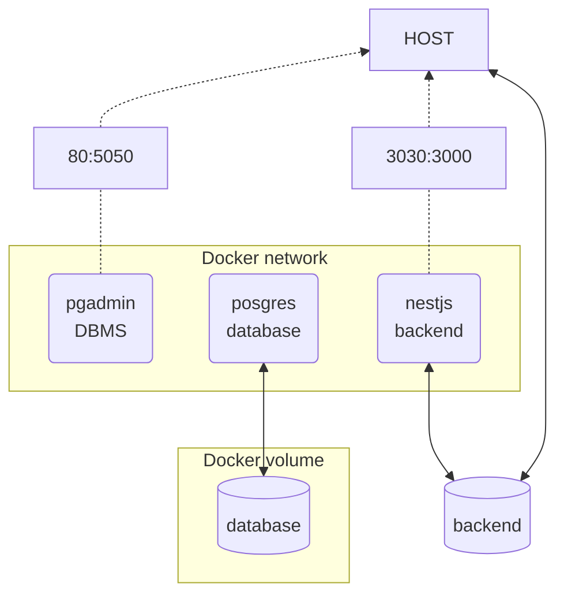

# ft_transcendence (42 project)

This project is about create a website where we can play [pong](https://en.wikipedia.org/wiki/Pong) with some friends.
We used [nestjs](https://nestjs.com/), (angular/vuejs?), [postgresql](https://www.postgresql.org/), [pgadmin](https://www.pgadmin.org/), [nginx](https://www.nginx.com/) and [docker](https://www.docker.com/).
To run the project you need to modify the sample.env and rename it to '.env'.

---

## Usage

Clone the project:
```$ git clone git@github.com:tsiguenz/ft_transcendence.git && cd ft_transcendence```

Build:
```$ make```

Stop the containers:
```$ make stop```

Delete the containers/volumes:
```$ make down```

Delete all the dockers elements (volumes/network/containers/images/cache):
```$ make rma```

Rebuilt (<=> make down + make):
```$ make re```

---

## Project architecture

Dev environment (in progress):


