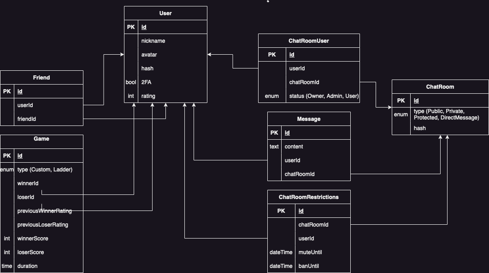

# Backend

The backend is the server side of the application. When the user do a request, the frontend render the page with dynamic content like the statistics of the old games who are stored in the database. The backend is where we are collecting this informations.
For this project, we used a REST API.

## API Methods

To see available routes you can access to swagger (http://localhost/3000/api).

## Database (old db, see prisma schema for current one)

